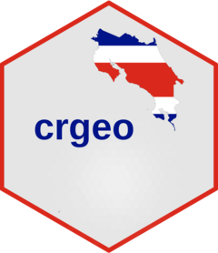
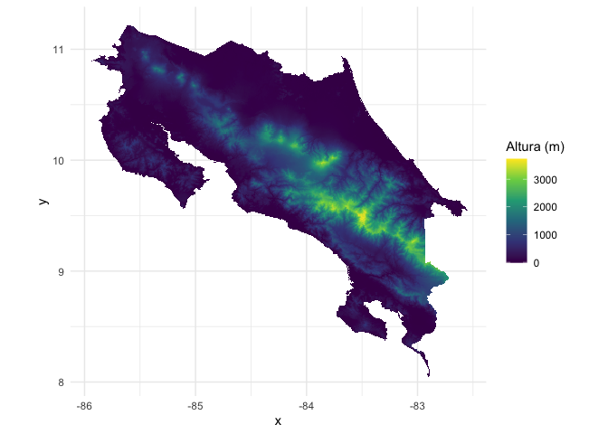

<!-- README.md is generated from README.Rmd. Please edit that file -->

# crgeo 

<!-- badges: start -->

[](https://travis-ci.com/ManuelSpinola/crgeo)
[](https://github.com/ManuelSpinola/crgeo/actions/workflows/R-CMD-check.yaml)
<!-- badges: end -->

The goal of crgeo is to access geospatial data for Costa Rica

## Installation

You can install the development version of crgeo from
[GitHub](https://github.com/) with:

``` r
# install.packages("devtools")
devtools::install_github("ManuelSpinola/crgeo")
```

## Example

This is a basic example which shows you how to solve a common problem:

``` r
library(crgeo)
library(sf)
#> Linking to GEOS 3.10.2, GDAL 3.4.2, PROJ 8.2.1; sf_use_s2() is TRUE
## basic example code
```

``` r
cr_outline
#> Simple feature collection with 1 feature and 1 field
#> Geometry type: MULTIPOLYGON
#> Dimension:     XY
#> Bounding box:  xmin: -87.10185 ymin: 5.49857 xmax: -82.55232 ymax: 11.21976
#> Geodetic CRS:  WGS 84
#>      COUNTRY                           geom
#> 1 Costa Rica MULTIPOLYGON (((-87.06877 5...
```

``` r
plot(cr_outline)
```


