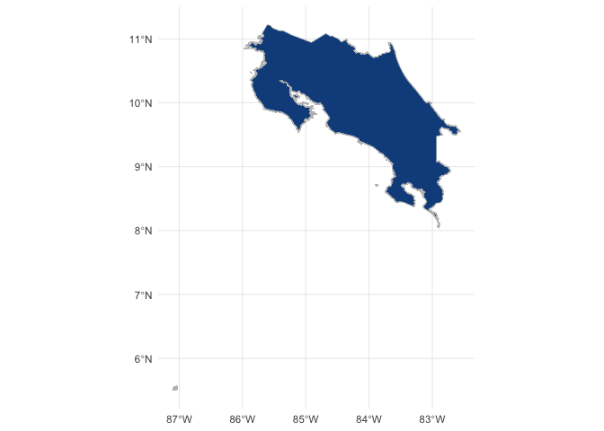

crgeo: Geospatial data of Costa Rica
================

<!-- README.md is generated from README.Rmd. Please edit that file -->

# crgeo 

<!-- badges: start -->
<!-- badges: end -->

The goal of crgeo is to provide geospatial data for Costa Rica

## Installation

You can install the development version of crgeo from
[GitHub](https://github.com/) with:

``` r
# install.packages("devtools")
devtools::install_github("ManuelSpinola/crgeo")
```

## Example

This is a basic example how to use the data in the package:

``` r
library(crgeo)
library(tidyverse)
library(sf)
library(stars)
```

``` r
ggplot(cr_outline) +
  geom_sf(fill = "dodgerblue4", color = "gray") +
  theme_minimal()
```



``` r
ggplot() +
  geom_stars(data = cr_elevation_c) +
  scale_fill_viridis_c(name = "Altura (m)", na.value = "transparent") +
  theme_minimal() +
  coord_equal()
```


